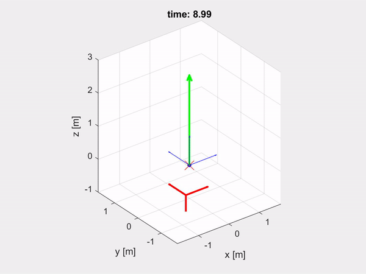

# **Learn Robotics - drones**
This repository contains notes and examples of modeling and control of a quadcopter.

## **Content**
### 1- Attitude_representation
- How to represent drone attitude (Euler angles, rotation matrix, quaternion)
- Conversion between states in body-fixed frame and inertial frame
### 2 Drone (Quadcopter) modeling
- Developing the equations of motions of a quadcopter
- Simulation of the model in Matlab and Simulink
### 3- Attitude control
- Control allocation and motor control
- Body rates control
- Euler angles based attitude control
- Rotation matrix based attitude control
- Quaternion based attitude control

### 4- Position control
- Position and velocity controller 
- Thrust to attitude conversion

### 5- State estimation
- Simulation of IMU sensor
- Attitude state estimation using Extended Kalman Filter (EKF)

## **Notes**
- Run the live script before running the simulation to set necessary parameters

## References

- https://www.ccs.neu.edu/home/rplatt/cs5335_fall2017/slides/euler_quaternions.pdf
