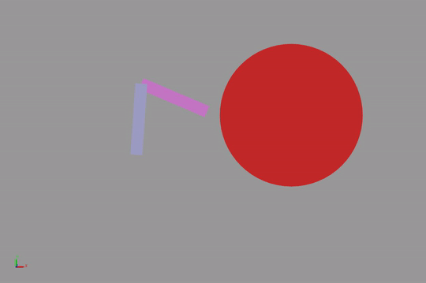
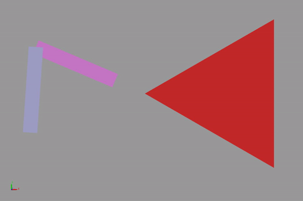

# **Learn Robotics**
This repository contains notes, simulations and explanations of multiple robotic concepts. It is organized such that concepts are incremental in complexity.
Read the readme within each subfolder for info on its content.

## **Requirements**
1. MATLAB R2021a or above
2. Install the Robotics Toolbox by Peter Corke. The correct version is provided with this repo `RTB.mltbx`
3. Add required folders to MATLAB path
   - `library` folder and subfolders

## **Basics**
### 1. symbolic math (MATLAB)
- Symbolic math vs numeric math
- Symbolic math operations in MATLAB
- Case study: Spring mass damper
## **Kinematics**
###  1. Planar Manipulators
###  2. Forward and inverse kinematics of three-link planar
###  3. Three-link planar from URDF and waypoint tracking

## **Dynamics**
### 1. Rigid body dynamics
- Intro to rigid body dynamics and equation of motions
- Simulate dynamics of a two-link planar arm using Robotics Toolbox
### 2. Two-link Planar (RR) dynamics
- Formulate the dynamics using Lagrange formulation
- Simulate the dynamics in Simulink
- Compare derived dynamics to SimScape multibody model

## **Control**
### 1- Introduction to joint control: 
- transfer function of a motor and simple control
- Simulink simulation
### 2- Joint control
- Ideal vs realistic simulations on Two-link planar (RR)
- Examples of different controllers:
    - PD control
    - PID control
    - Full state feedback control (Pole Placement and LQR)
    - Gravity compensated control
    - Inverse Dynamics control
    - Robust control
### 3- Task control
- Ideal simulations on Two-link planar (RR)
- Examples of different controllers:
    - PID control
    - Gravity compensated PD control
    - Full state feedback control (Pole Placement and LQR)
    - Inverse Dynamics control
    - Robust control (Sliding mode control)

### 4- Impedance/compliance control
- Simulations of Two-link planar (RR) interacting with different environments and target trajectories
- Examples of different controllers:
    - Impedance control with force/torque (F/T) sensor 
    - Impedance control without (F/T sensor 
- Examples of different environments:
    - Straight Wall environment
    - Curved environment
    - Extruded environment

## **docs**
  Contains reports that analyze and summarize results

## **Drawings**
Contains some drawing files and block diagrams

## **Media**
Contains videos and images of sample results.

## **library**
Contains scripts and functions that are used in other modules

## **Notes**
Each module should contain a citation of all references consulted and external materials/code used.

## **Good references**
### Manipulators
- [Designing Robot Manipulator Algorithms](https://www.mathworks.com/videos/matlab-and-simulink-robotics-arena-designing-robot-manipulator-algorithms-1515776491590.html?s_tid=vid_pers_recs)

- [Controlling Robot Manipulator Joints](https://www.mathworks.com/videos/matlab-and-simulink-robotics-arena-controlling-robot-manipulator-joints-1521714030608.html)
-  [Trajectory Planning for Robot Manipulators](https://www.mathworks.com/videos/trajectory-planning-for-robot-manipulators-1556705635398.html)

- [Trajectory Tracking Control via Decentralized Joint-Level Schemes](https://github.com/RickyMexx/ttc-decentralized)

